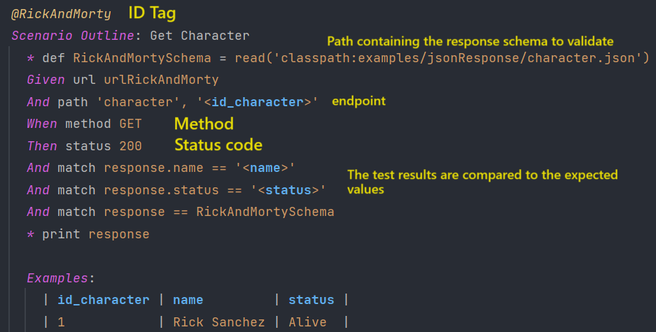

#  LIPPIA API Sample Project Karate

## Purpose:
The following project has the purpose of demonstrate and let test automation developers to test API using the framework **Karate**. An XML report is generated in a format compatible with **LTM's REST API**. This report encapsulates the test information and execution results. Upon completion of the execution, the plugin utilizes LTM's REST API to upload the XML report to the LTM platform.

## System Requirements:
- JDK: [https://docs.oracle.com/en/java/javase/index.html](https://docs.oracle.com/en/java/javase/index.html)
- Maven: [https://maven.apache.org/download.cgi](https://maven.apache.org/download.cgi)

# Reports integrations
We believe that reports should clearly, comprehensively, and engagingly communicate the results of our testing. This ensures that our clients have a thorough understanding of their product's performance and behavior, as well as the team's performance, providing a complete understanding of the findings obtained.

- **Lippia Test Manager** A solution that combines manual and automated test results in a single platform. For more information, go to  [Lippia.io](https://lippia.io)
- **KarateReport** a community solution for simple reports.
### [](#lippia-test-manager)Lippia Test Manager

This integration uses an adaptar that automatically ingests results of Scenarios into Lippia Test Manager. You just simply need to implement [ karate-adapter-jvm](https://gitlab.crowdaronline.com/lippia/products/test-manager/adapters/karate-adapter) and you can see the results in Lippia Test Manager as an Automated Run Result.


###  **Settings**
In order for the plugin to upload reports to LTM, the variables in the pom.xml file must be configured. These include:
-   **pom.xml:** The project's Maven configuration file.
-   **Project code:** A unique identifier for the project.
-   **Run name:** A descriptive name for the test run.

    ```
    <plugin>
                <groupId>org.apache.maven.plugins</groupId>
                <artifactId>maven-surefire-plugin</artifactId>
                <version>3.0.0-M4</version>
                <configuration>
                    <useSystemClassLoader>false</useSystemClassLoader>
                    <systemPropertyVariables>
                        <TEST_MANAGER_API_HOST>${ltm.apihost}</TEST_MANAGER_API_HOST>
                        <TEST_MANAGER_RUN_NAME>${ltm.run_name}</TEST_MANAGER_RUN_NAME>
                        <TEST_MANAGER_PROJECT_CODE>${ltm.project_code}</TEST_MANAGER_PROJECT_CODE>
                        <TEST_MANAGER_USERNAME>${ltm.username}</TEST_MANAGER_USERNAME>
                        <TEST_MANAGER_PASSWORD>${ltm.password}</TEST_MANAGER_PASSWORD>
                    </systemPropertyVariables>
                </configuration>
        </plugin>
    ```


### Reports Integration
Reports are generated in the folder called **target**, which will be generated once the execution of the test suite is finished.  
Note that the following structure is part of the report generated with **KarateReport** library after running the test project using the Extent plugin. Results report can be found at _llippia-api-sample-project-karate/target/karate-reports/karate-summary.html_


## Project structure
```
???src
    ??? test
         ??? java
              ??? examples
              ?        ??? users
              |        |     ??? users.feature
              |        |     ??? UsersRunner.java
              |        ??? ExampleTest.java
              |        ??? TestManagerReporter.java
              ??? karate-config.js
              ??? logback-test.xml
```
### Running Tests
```
clean test -DforkCount=0
clean test -DforkCount=0 "-Dcucumber.options=--tags @test"
```

### Running Tests by profiles
The project is divided into two execution profiles based on the desired outcome
```
Using integrated Karate report
clean test -Pusers-tests -DforkCount=0
```
```
Publish the execution results in LTM
clean test -Pexamples-tests -DforkCount=0

```

Folder's description:

| Path                                     | Description                                                                                                                           |
|------------------------------------------|---------------------------------------------------------------------------------------------------------------------------------------|
| src/test/java/examples/*.feature         | Folder with all the feature files containing Test Scenarios                                                                           |
| src/test/java/examples/ExamplesTest.java | It offers a starting point for creating custom test runners that leverage Karate's capabilities for parallel execution and reporting. |
| src/test/java/karate-config.js           | Folder with all the global settings that govern the behavior of Karate during test execution                                          |
| request/*.json                           | Folder with all the json files containing Request data                                                                                |
| response/*.json                          | Folder with all the json files containing Response data                                                                               |
| examples/users/UsersRunner.java          | The test suite's classpath is defined in this folder. Sequential Runner                                                                                |

### Karate example



### pom.xml
A Project Object Model or POM is the fundamental unit of work in Maven. It is an XML file that contains information about the project and configuration details used by Maven to build the project
